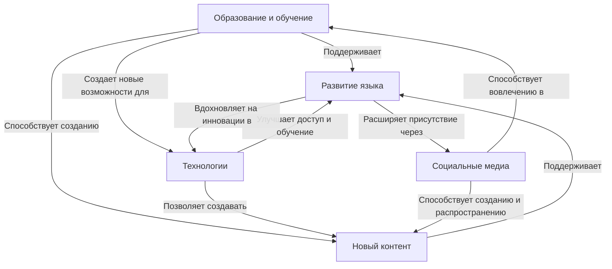

## Важность Продвижения в Направлениях

Продвижение в одном из направлений может значительно помочь в развитии других направлений, создавая синергию между
различными аспектами сохранения и развития языка.

<v-click>

Сферы влияния включают:

- **Образование и обучение:** Разработка и внедрение новых образовательных программ и курсов для изучения языка.
- **Технологии:** Создание программного обеспечения и приложений для лучшего доступа к языковым ресурсам.
- **Социальные медиа:** Поощрение использования языка в социальных сетях для увеличения интереса к обучению и использованию языка.

</v-click>

<v-click>

Каждый шаг вперед в одной из этих областей может привести к улучшениям в других областях:

- **Разработка инструментов** может упростить создание контента на языке.
- **Улучшение доступности обучающих материалов** может повысить интерес и вовлеченность в изучении языка.

</v-click>

---

<v-click>

Давайте жить дружно и помогать языку вместе :)
</v-click>

